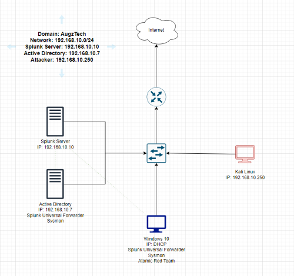
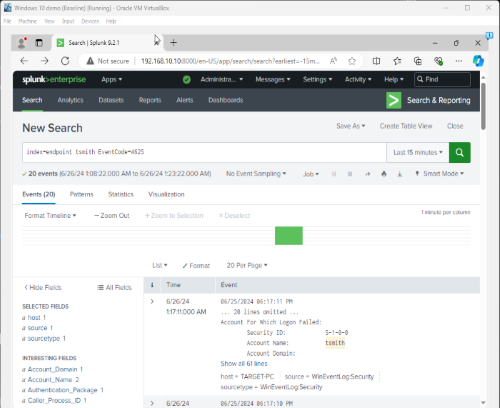

# AD-Lab

## Goals
1. To set up a virtual Active Directory lab environment. This hands-on experience was primarily designed to explore how a domain environment works and how to troubleshoot common issues.
2. To learn how to generate, ingest, and analyze logs within a SIEM to simulate real-world attack scenarios using Splunk, Linux, and Atomic Red Team for simulating and detecting attacks.

### Skills Learned
- Basic understanding of Active Directory, common issues, and solutions. 
- Basic understanding of SIEM concepts and practical application.
- Proficiency in analyzing and interpreting network logs.
- Ability to generate and recognize basic attack signatures and patterns.
- Intermediate knowledge of network protocols and security vulnerabilities.
- Development of critical thinking and problem-solving skills within a simulated scenario.

### Tools Used
- Security Information and Event Management (SIEM) system for log ingestion and analysis.
- Network analysis tools for capturing and examining network traffic.
- Telemetry generation tools to create realistic network traffic and attack scenarios.
- Open source library of tests for adversary simulation and defense validation.
- Powershell scripts to automate processes, such as adding new users to the environment.
- Windows Sysinternals tools for troubleshooting, monitoring processes, viewing logs, etc.

## Steps
1) Build a logical diagram of the virtual network.
   
2) Install virtual machines.
   - Windows Server
   - Windows 10
   - Kali Linux
   - Linux Server
     
3) Install and configure software.
   - Sysmon
   - Splunk
   - Wireshark
     
4) Configure Active Directory Domain Services (AD DS) and other roles.
   - Promote server to a domain controller.
   - Configure DNS, and DHCP servers on domain controller. 
   - Add users and groups to domain.
   - Join target PC's to domain.
   - Add Group Policy Objects (GPO).
   - Configure Windows Server Update Services (WSUS).

5) Generate telemetry with Kali Linux and Atomic Red Team tests.
   - Use Linux machine to run brute force attacks (Crowbar) targeting a domain user.
   - Install Atomic Red Team and run various tests.
     
6) Analyze and query generated telemetry using Splunk.

7) Monitor network traffic using Wireshark.

## Screenshots

